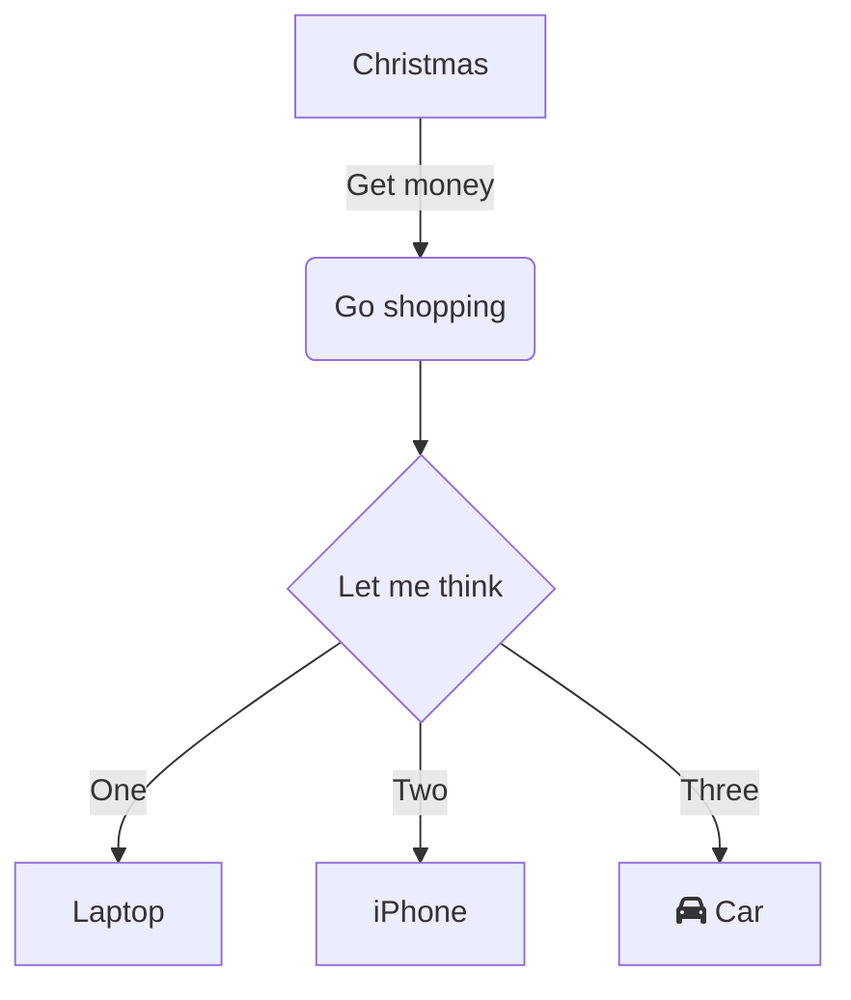
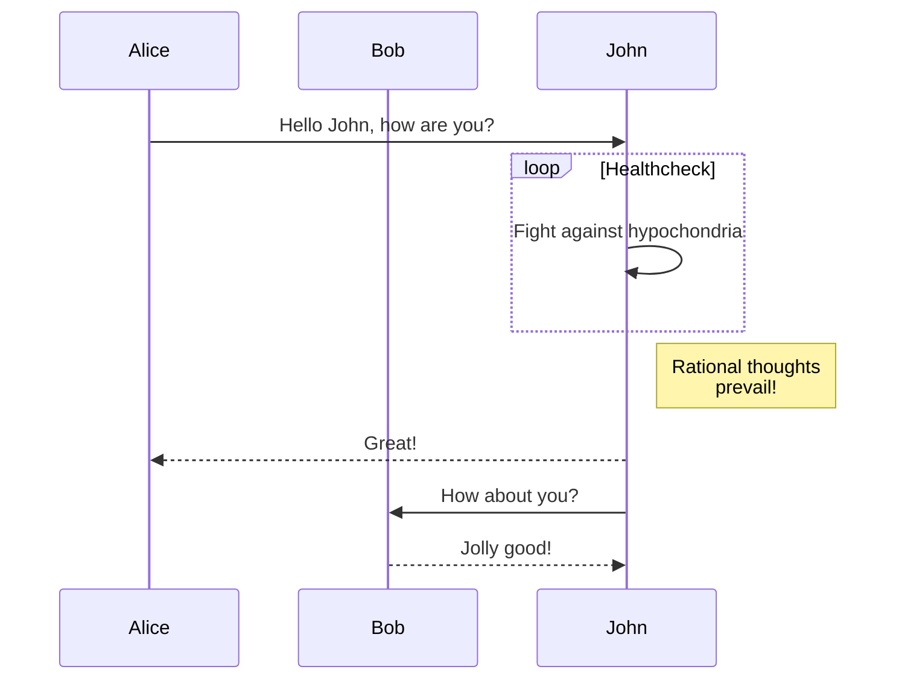
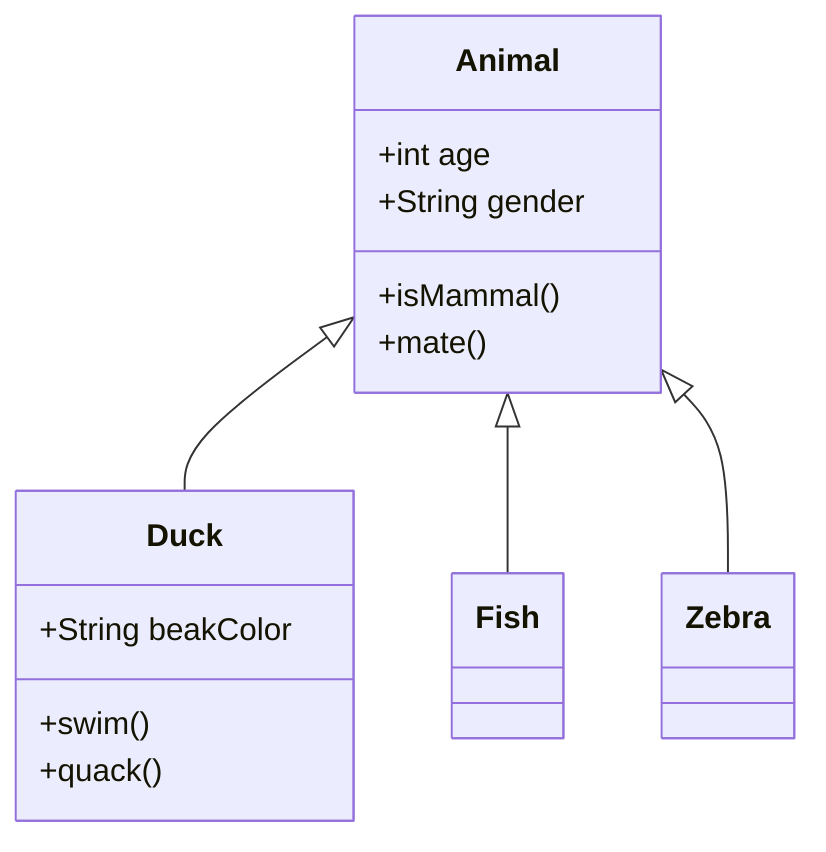
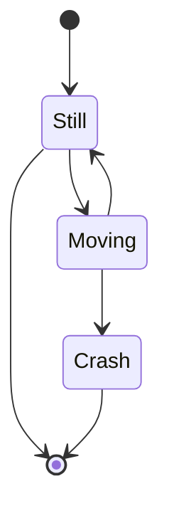
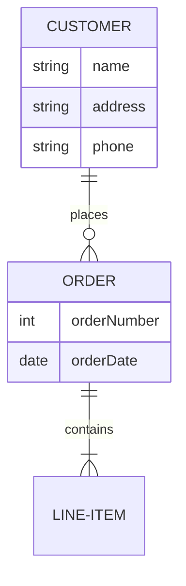

# Mermaid Live MCP Server

A Model Context Protocol (MCP) server for generating and working with Mermaid diagrams through Mermaid Live and Mermaid Ink services.

## Features

- **Interactive Editing**: Generate Mermaid Live Editor URLs for interactive diagram editing
- **View-Only Sharing**: Create view-only URLs for sharing diagrams without editing capabilities  
- **Multiple Formats**: Export diagrams as PNG, JPEG, WebP, SVG, or PDF
- **Customization**: Configure themes, colors, sizes, and other rendering options

## Installation

```bash
npm install mermaid-live-mcp-server
```

## Usage

### As an MCP Server

Add to your MCP client configuration:

```json
{
  "servers": {
    "mermaid-live": {
      "command": "npx",
      "args": ["mermaid-live-mcp-server"]
    }
  }
}
```

### Tool: `create-mermaid-diagram`

A unified tool for generating Mermaid diagrams with two actions:

#### Action: `get_url`
Returns multiple URLs for different purposes:
- **Interactive Editor URL**: Edit the diagram with live preview
- **View-only URL**: Share diagrams without edit controls
- **Direct Image URLs**: PNG, SVG, and PDF formats for embedding/downloading

#### Action: `save_file`
Saves the diagram to a file in your chosen format.

### Parameters

- `action` (required): `"get_url"` or `"save_file"`
- `diagram` (required): The Mermaid diagram code
- `outputPath`: File path for saving (required for `save_file`)
- `format`: Output format - `"png"` (default), `"jpeg"`, `"webp"`, `"svg"`, or `"pdf"`
- `width`: Width in pixels (for image/SVG)
- `height`: Height in pixels (for image/SVG)
- `scale`: Scale factor (for image/SVG)
- `bgColor`: Background color (e.g., `"white"`, `"#FFFFFF"`)
- `theme`: Mermaid theme - `"default"`, `"neutral"`, `"dark"`, or `"forest"`
- `fit`: Fit diagram to page size (boolean, for PDF)
- `paper`: Paper size - `"a3"`, `"a4"`, or `"a5"` (for PDF)
- `landscape`: Use landscape orientation (boolean, for PDF)

### Examples

#### Get All URLs for a Diagram
```json
{
  "tool": "create-mermaid-diagram",
  "arguments": {
    "action": "get_url",
    "diagram": "graph TD\n  A[Start] --> B[Process]\n  B --> C[End]",
    "theme": "dark"
  }
}
```

Returns:
- Interactive editor URL
- View-only sharing URL
- Direct PNG image URL
- SVG vector image URL
- PDF document URL

#### Save as PNG with Custom Theme
```json
{
  "tool": "create-mermaid-diagram",
  "arguments": {
    "action": "save_file",
    "diagram": "sequenceDiagram\n  Alice->>Bob: Hello\n  Bob->>Alice: Hi!",
    "outputPath": "./sequence.png",
    "format": "png",
    "theme": "dark",
    "bgColor": "#1e1e1e",
    "width": 800
  }
}
```

#### Save as SVG
```json
{
  "tool": "create-mermaid-diagram",
  "arguments": {
    "action": "save_file",
    "diagram": "pie title Pets\n  'Dogs' : 386\n  'Cats' : 85\n  'Rats' : 15",
    "outputPath": "./chart.svg",
    "format": "svg",
    "theme": "neutral"
  }
}
```

#### Save as PDF with A4 Paper
```json
{
  "tool": "create-mermaid-diagram",
  "arguments": {
    "action": "save_file",
    "diagram": "flowchart LR\n  A[Input] --> B{Decision}\n  B -->|Yes| C[Output 1]\n  B -->|No| D[Output 2]",
    "outputPath": "./flowchart.pdf",
    "format": "pdf",
    "paper": "a4",
    "fit": true
  }
}
```

## Mermaid Diagram Examples

### Flowchart


### Sequence Diagram


### Class Diagram


### State Diagram


### Entity Relationship Diagram


## Development

```bash
# Install dependencies
npm install

# Build the project
npm run build

# Run in development mode
npm run dev
```

## License

MIT