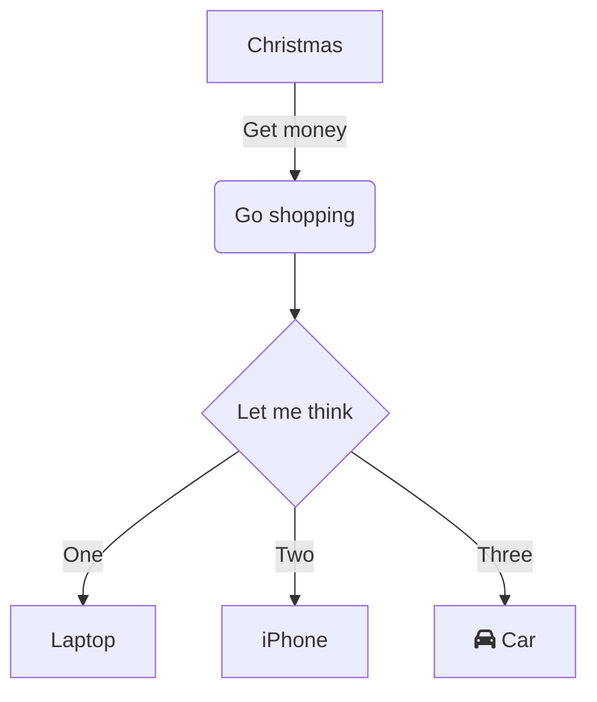
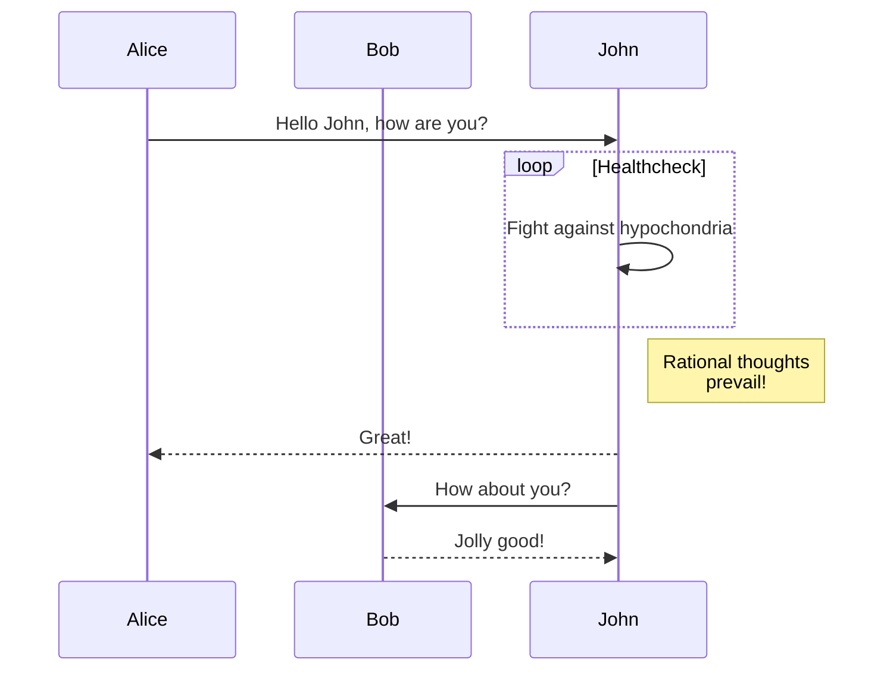
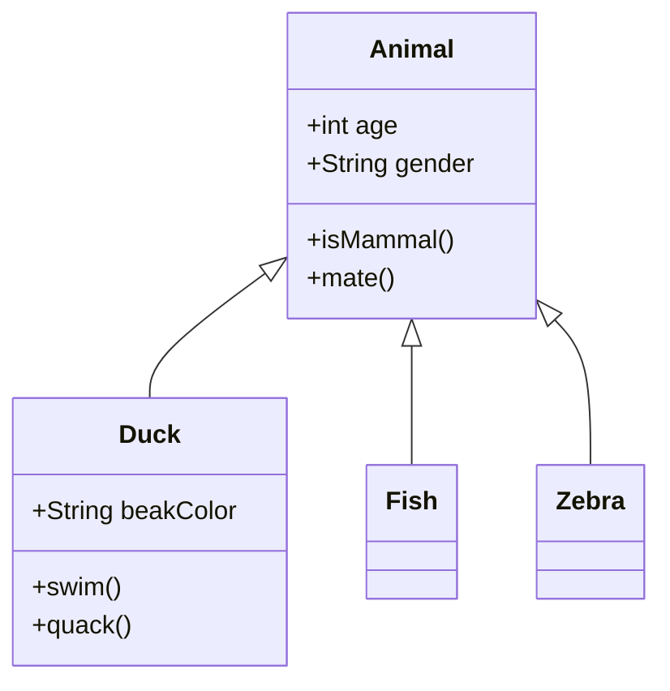
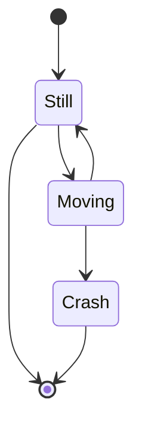
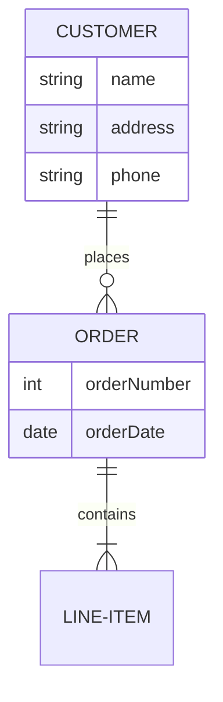

[English](README.md) | [日本語](README_ja.md) | **README**

# Mermaid Live MCP Server

## Overview

This Model Context Protocol (MCP) server provides powerful diagram creation tools using Mermaid Live and Mermaid Ink services.  
With this MCP, AI assistants can create flowcharts, sequence diagrams, class diagrams, and other Mermaid visualizations.

**Example prompts:**

- "Create a flowchart showing our deployment process"
- "Generate a sequence diagram for user authentication"
- "Draw a class diagram for our database schema"
- "Make a Gantt chart for project timeline"
- "Create a network diagram of our system architecture"

**The AI will:**

1. Convert your description into proper Mermaid syntax
2. Generate live editing and viewing URLs
3. Create image outputs in various formats
4. Save or display the result as needed

### Output Options

**Get URLs:** Perfect for sharing, embedding in web pages, or collaborative editing  
**Save Files:** Ideal for reports, presentations, or archival purposes

**Supported Formats:**

- **Images**: PNG, JPEG, WebP
- **Vector Graphics**: SVG
- **Documents**: PDF

**File Management:**

- Files are saved to your Desktop by default (configurable)
- Custom output directory via environment variable
- Custom paths supported for organization
- Automatic directory creation when needed

## Installation

### Via Claude Desktop

Add to your Claude Desktop configuration:

```json
{
  "mcpServers": {
    "mermaid-live": {
      "command": "npx",
      "args": ["-y", "@takanarishimbo/mermaid-live-mcp-server"]
    }
  }
}
```

### With Custom Configuration

```json
{
  "mcpServers": {
    "mermaid-live": {
      "command": "npx",
      "args": ["-y", "@takanarishimbo/mermaid-live-mcp-server"],
      "env": {
        "MERMAID_LIVE_BASE_URL": "https://your-mermaid-live-instance.com",
        "MERMAID_INK_BASE_URL": "https://your-mermaid-ink-instance.com",
        "MERMAID_DEFAULT_OUTPUT_DIR": "/home/username/Downloads",
        "MERMAID_ENABLE_CREATE_MERMAID_DIAGRAM": "true"
      }
    }
  }
}
```

### Environment Variables

**URL Configuration:**

- **MERMAID_LIVE_BASE_URL**: Mermaid Live editor base URL (default: `https://mermaid.live`)
- **MERMAID_INK_BASE_URL**: Mermaid Ink rendering service base URL (default: `https://mermaid.ink`)

Setting `MERMAID_LIVE_BASE_URL` will configure these endpoints:

- Editor: `{BASE_URL}/edit`
- Viewer: `{BASE_URL}/view`

Setting `MERMAID_INK_BASE_URL` will configure these endpoints:

- Images: `{BASE_URL}/img`
- SVG: `{BASE_URL}/svg`
- PDF: `{BASE_URL}/pdf`

**Tool Disable Settings:**
To disable specific tools, set these environment variables to `false`:

- **MERMAID_ENABLE_CREATE_MERMAID_DIAGRAM**: Mermaid diagram creation tool

**File Management:**

- **MERMAID_DEFAULT_OUTPUT_DIR**: Default directory for saving files (absolute path, default: `Desktop` in home directory)

**Default Output Directory Examples:**

```bash
# Save to custom diagrams directory (Linux/macOS)
MERMAID_DEFAULT_OUTPUT_DIR=/home/username/Documents/diagrams

# Save to custom diagrams directory (Windows)
MERMAID_DEFAULT_OUTPUT_DIR=C:/Users/username/Documents/diagrams
```

## Tools

### `create-mermaid-diagram`

Create Mermaid diagrams - get URLs for editing/viewing/downloading or save diagram to file

**Documentation**: [Mermaid Live Editor](https://mermaid.live/) | [Mermaid Ink API](https://mermaid.ink/)

- **Input**: Action (get_url/save_file), diagram code, outputPath, format options, dimensions, and styling options
- **Output**: Diagram URLs with live editor access or confirmation message with saved file path

**Supported Diagram Types:**

- **flowchart**: Flowcharts and process diagrams
- **sequence**: Sequence diagrams for interactions
- **class**: Class diagrams for object-oriented design
- **state**: State diagrams for system states
- **er**: Entity relationship diagrams
- **gantt**: Gantt charts for project planning
- **pie**: Pie charts for data visualization
- **journey**: User journey maps
- **gitgraph**: Git branching diagrams
- **mindmap**: Mind maps for brainstorming
- **timeline**: Timeline visualizations
- **sankey**: Sankey diagrams for flow visualization
- **requirement**: Requirement diagrams
- **quadrant**: Quadrant charts for analysis

**Prompt Examples:**

- **System Architecture**: "Create a flowchart showing our microservices architecture"
- **Process Documentation**: "Generate a sequence diagram for the login process"
- **Database Design**: "Draw an ER diagram for our user management system"
- **Project Planning**: "Make a Gantt chart for the next quarter's roadmap"
- **Decision Trees**: "Create a flowchart for our customer support escalation process"

**Available Themes:**

- **default**: Standard Mermaid theme
- **neutral**: Neutral color scheme
- **dark**: Dark theme for presentations
- **forest**: Green-themed color scheme

**Image Format Options:**

- **PNG**: Raster format, good for presentations and documents
- **JPEG**: Compressed format, smaller file sizes
- **WebP**: Modern format with excellent compression
- **SVG**: Vector format, scalable and editable
- **PDF**: Document format, ideal for printing

**PDF-Specific Options:**

- **Paper sizes**: A3, A4, A5
- **Orientation**: Portrait or landscape
- **Fit to page**: Automatic scaling to fit page size

**Usage Examples for AI:**

```json
{
  "action": "save_file",
  "diagram": "flowchart TD\n    A[Start] --> B{Decision}\n    B -->|Yes| C[Process]\n    B -->|No| D[End]\n    C --> D",
  "format": "png",
  "width": 800,
  "height": 600,
  "theme": "default",
  "bgColor": "white"
}
```

## Mermaid Diagram Examples

### Flowchart



### Sequence Diagram



### Class Diagram



### State Diagram



### Entity Relationship Diagram



## Development

1. **Clone this repository**

   ```bash
   git clone https://github.com/TakanariShimbo/mermaid-live-mcp-server.git
   cd mermaid-live-mcp-server
   ```

2. **Install dependencies**

   ```bash
   npm ci
   ```

3. **Build the project**

   ```bash
   npm run build
   ```

4. **Test with MCP Inspector (optional)**

   ```bash
   npx @modelcontextprotocol/inspector node dist/index.js
   ```

## Publishing to NPM

This project includes automated NPM publishing via GitHub Actions. To set up publishing:

### 1. Create NPM Access Token

1. **Log in to NPM** (create account if needed)

   ```bash
   npm login
   ```

2. **Create Access Token**
   - Go to [https://www.npmjs.com/settings/tokens](https://www.npmjs.com/settings/tokens)
   - Click "Generate New Token"
   - Select "Automation" (for CI/CD usage)
   - Copy the generated token (starts with `npm_`)

### 2. Add Token to GitHub Repository

1. **Navigate to Repository Settings**

   - Go to your GitHub repository
   - Click "Settings" tab
   - Go to "Secrets and variables" → "Actions"

2. **Add NPM Token**
   - Click "New repository secret"
   - Name: `NPM_TOKEN`
   - Value: Paste your NPM token from step 1
   - Click "Add secret"

### 3. Setup GitHub Personal Access Token (for release script)

The release script needs to push to GitHub, so you'll need a GitHub token:

1. **Create GitHub Personal Access Token**

   - Go to [https://github.com/settings/tokens](https://github.com/settings/tokens)
   - Click "Generate new token" → "Generate new token (classic)"
   - Set expiration (recommended: 90 days or custom)
   - Select scopes:
     - ✅ `repo` (Full control of private repositories)
   - Click "Generate token"
   - Copy the generated token (starts with `ghp_`)

2. **Configure Git with Token**

   ```bash
   # Option 1: Use GitHub CLI (recommended)
   gh auth login

   # Option 2: Configure git to use token
   git config --global credential.helper store

   # Then when prompted for password, use your token instead
   ```

### 4. Release New Version

Use the included release script to automatically version, tag, and trigger publishing:

```bash
# Increment patch version (0.1.0 → 0.1.1)
npm run release patch

# Increment minor version (0.1.0 → 0.2.0)
npm run release minor

# Increment major version (0.1.0 → 1.0.0)
npm run release major

# Set specific version
npm run release 1.2.3
```

### 5. Verify Publication

1. **Check GitHub Actions**

   - Go to "Actions" tab in your repository
   - Verify the "Publish to npm" workflow completed successfully

2. **Verify NPM Package**
   - Visit: `https://www.npmjs.com/package/@takanarishimbo/mermaid-live-mcp-server`
   - Or run: `npm view @takanarishimbo/mermaid-live-mcp-server`

### Release Process Flow

1. `release.sh` script updates version in all files
2. Creates git commit and tag
3. Pushes to GitHub
4. GitHub Actions workflow triggers on new tag
5. Workflow builds project and publishes to NPM
6. Package becomes available globally via `npm install`

## Creating Desktop Extension (DXT)

Desktop Extensions (.dxt) enable one-click installation of MCP servers in Claude Desktop. To create a DXT file for this server:

### 1. Initialize DXT Manifest

Run this command in the project root directory:

```bash
npx @anthropic-ai/dxt init
```

### 2. Create DXT Package

```bash
npx @anthropic-ai/dxt pack
```

This creates a `.dxt` file that users can install in Claude Desktop with a single click.

### 3. User Configuration

The DXT file includes user-configurable options that allow users to:

- **URL Configuration**: Set custom QuickChart instance URLs
- **Tool Management**: Enable/disable specific visualization tools
- **Easy Installation**: No manual JSON configuration required

Users can modify these settings during installation or later through Claude Desktop's extension management interface.

## Project Structure

```
mermaid-live-mcp-server/
├── src/
│   ├── index.ts          # Main server implementation
│   ├── tools/
│   │   ├── index.ts      # Tool registry and exports
│   │   └── mermaid.ts    # Mermaid diagram tool
│   └── utils/
│       ├── config.ts     # Configuration management
│       └── file.ts       # File utilities
├── package.json          # Package configuration
├── package-lock.json
├── tsconfig.json         # TypeScript configuration
├── .github/
│   └── workflows/
│       └── npm-publish.yml   # NPM publish workflow
├── scripts/
│   └── release.sh        # Release automation script
├── docs/
│   ├── README.md         # This file
│   └── README_ja.md      # Japanese documentation
└── .gitignore            # Git ignore file
```

## Resources

### Official Documentation

#### Mermaid

- [Mermaid Documentation](https://mermaid.js.org/) - Comprehensive guide to Mermaid syntax and features
- [Mermaid Live Editor](https://mermaid.live/) - Online editor for creating and sharing diagrams
- [Mermaid Ink API](https://mermaid.ink/) - API for rendering Mermaid diagrams as images

#### Diagram Types

- [Flowchart Syntax](https://mermaid.js.org/syntax/flowchart.html) - Flowchart creation guide
- [Sequence Diagram Syntax](https://mermaid.js.org/syntax/sequenceDiagram.html) - Sequence diagram reference
- [Class Diagram Syntax](https://mermaid.js.org/syntax/classDiagram.html) - Class diagram documentation
- [State Diagram Syntax](https://mermaid.js.org/syntax/stateDiagram.html) - State diagram guide
- [ER Diagram Syntax](https://mermaid.js.org/syntax/entityRelationshipDiagram.html) - Entity relationship diagrams
- [Gantt Chart Syntax](https://mermaid.js.org/syntax/gantt.html) - Project timeline charts

#### MCP Protocol

- [Model Context Protocol](https://modelcontextprotocol.io/) - Official MCP specification
- [MCP SDK Documentation](https://github.com/modelcontextprotocol/typescript-sdk) - TypeScript SDK for MCP
- [Claude Desktop MCP Guide](https://docs.anthropic.com/en/docs/build-with-claude/mcp) - Using MCP with Claude
- [MCP Inspector](https://github.com/modelcontextprotocol/inspector) - Debug and test MCP servers

### Tutorials & Examples

#### Getting Started

- [Mermaid Tutorial](https://mermaid.js.org/intro/) - Step-by-step introduction to Mermaid
- [Diagram Examples](https://mermaid.js.org/syntax/examples.html) - Collection of example diagrams
- [Live Editor Examples](https://mermaid.live/edit) - Interactive diagram examples

#### Advanced Usage

- [Theming and Configuration](https://mermaid.js.org/config/theming.html) - Customizing diagram appearance
- [Diagram Directives](https://mermaid.js.org/config/directives.html) - Advanced configuration options
- [Best Practices](https://mermaid.js.org/community/best-practices.html) - Tips for effective diagrams

#### Development Tools

- [Mermaid CLI](https://github.com/mermaid-js/mermaid-cli) - Command-line tool for generating diagrams
- [VS Code Extension](https://marketplace.visualstudio.com/items?itemName=bierner.markdown-mermaid) - Mermaid preview in VS Code
- [Online Editor](https://mermaid.live/) - Browser-based diagram editor

## License

MIT - See [LICENSE](LICENSE) file for details
