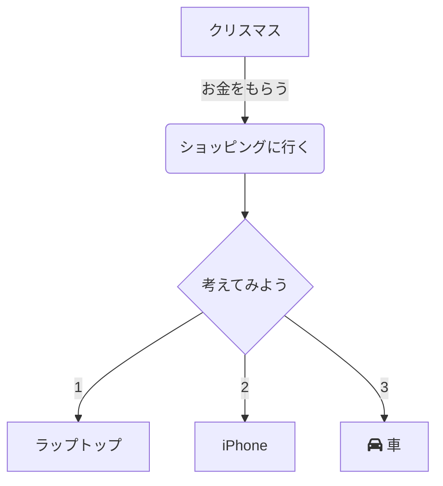
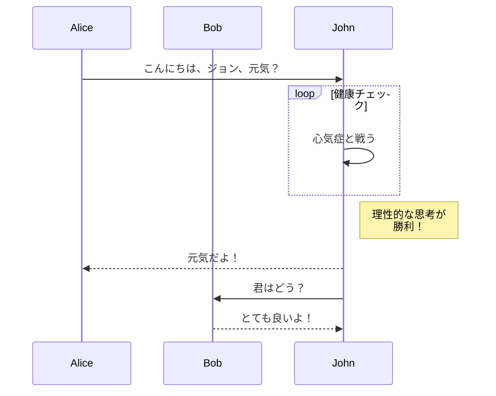
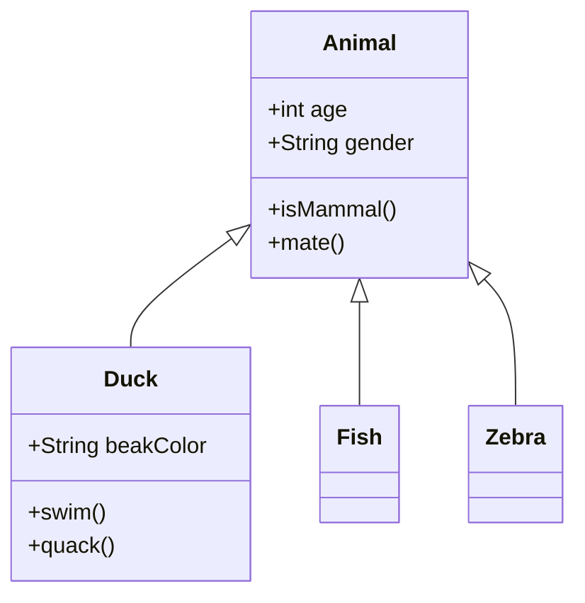
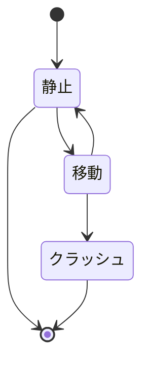
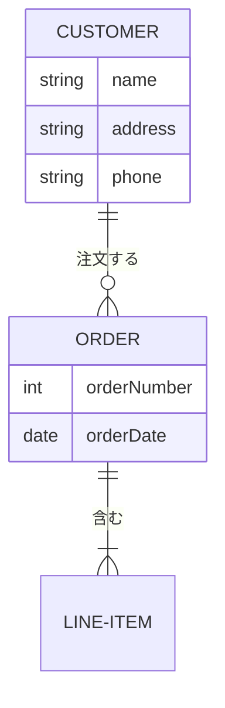

[English](README.md) | [日本語](README_ja.md) | **README**

# Mermaid Live MCP サーバー

## 概要

この Model Context Protocol (MCP) サーバーは、Mermaid Live および Mermaid Ink サービスを使用した強力な図表作成ツールを提供します。  
AI アシスタントは、この MCP を経由することで、フローチャート、シーケンス図、クラス図、その他の Mermaid 図表を作成することができるようになります。

**プロンプトの例:**

- "デプロイメントプロセスのフローチャートを作成して"
- "ユーザー認証のシーケンス図を生成して"
- "データベーススキーマのクラス図を描いて"
- "プロジェクトタイムラインのガントチャートを作って"
- "システムアーキテクチャのネットワーク図を作成して"

**AI が行うこと:**

1. 説明を適切な Mermaid 構文に変換
2. ライブ編集および表示 URL を生成
3. 様々な形式での画像出力を作成
4. 必要に応じて結果を保存または表示

### 出力オプション

**URL 取得:** 共有、ウェブページへの埋め込み、共同編集に最適  
**ファイル保存:** レポート、プレゼンテーション、アーカイブ目的に理想的

**サポートされる形式:**

- **画像**: PNG、JPEG、WebP
- **ベクター画像**: SVG
- **ドキュメント**: PDF

**ファイル管理:**

- ファイルはデフォルトでデスクトップに保存（設定可能）
- 環境変数によるカスタム出力ディレクトリ
- 整理のためのカスタムパスサポート
- 必要に応じて自動ディレクトリ作成

## インストール

### Claude Desktop 経由

Claude Desktop の設定に追加：

```json
{
  "mcpServers": {
    "mermaid-live": {
      "command": "npx",
      "args": ["-y", "@takanarishimbo/mermaid-live-mcp-server"]
    }
  }
}
```

### カスタム設定を使用

```json
{
  "mcpServers": {
    "mermaid-live": {
      "command": "npx",
      "args": ["-y", "@takanarishimbo/mermaid-live-mcp-server"],
      "env": {
        "MERMAID_LIVE_BASE_URL": "https://your-mermaid-live-instance.com",
        "MERMAID_INK_BASE_URL": "https://your-mermaid-ink-instance.com",
        "MERMAID_DEFAULT_OUTPUT_DIR": "/home/username/Downloads",
        "MERMAID_ENABLE_CREATE_MERMAID_DIAGRAM": "true"
      }
    }
  }
}
```

### 環境変数

**URL 設定:**

- **MERMAID_LIVE_BASE_URL**: Mermaid Live エディター ベース URL（デフォルト: `https://mermaid.live`）
- **MERMAID_INK_BASE_URL**: Mermaid Ink レンダリングサービス ベース URL（デフォルト: `https://mermaid.ink`）

`MERMAID_LIVE_BASE_URL` を設定すると、以下のエンドポイントが設定されます：

- エディター: `{BASE_URL}/edit`
- ビューアー: `{BASE_URL}/view`

`MERMAID_INK_BASE_URL` を設定すると、以下のエンドポイントが設定されます：

- 画像: `{BASE_URL}/img`
- SVG: `{BASE_URL}/svg`
- PDF: `{BASE_URL}/pdf`

**ツール無効化設定:**
特定のツールを無効化する場合は、以下の環境変数を `false` に設定してください：

- **MERMAID_ENABLE_CREATE_MERMAID_DIAGRAM**: Mermaid 図表作成ツール

**ファイル管理:**

- **MERMAID_DEFAULT_OUTPUT_DIR**: ファイル保存用のデフォルトディレクトリ（絶対パス、デフォルト: ホームディレクトリの `Desktop`）

**デフォルト出力ディレクトリの例:**

```bash
# カスタム図表ディレクトリに保存（Linux/macOS）
MERMAID_DEFAULT_OUTPUT_DIR=/home/username/Documents/diagrams

# カスタム図表ディレクトリに保存（Windows）
MERMAID_DEFAULT_OUTPUT_DIR=C:/Users/username/Documents/diagrams
```

## ツール

### `create-mermaid-diagram`

Mermaid 図表を作成 - 編集/表示/ダウンロード用の URL 取得またはファイル保存

**ドキュメント**: [Mermaid Live Editor](https://mermaid.live/) | [Mermaid Ink API](https://mermaid.ink/)

- **入力**: アクション（get_url/save_file）、図表コード、出力パス、フォーマットオプション、寸法、スタイリングオプション
- **出力**: ライブエディターアクセス付き図表 URL または保存されたファイルパスを含む確認メッセージ

**サポートされる図表タイプ:**

- **flowchart**: フローチャートとプロセス図
- **sequence**: インタラクション用のシーケンス図
- **class**: オブジェクト指向設計用のクラス図
- **state**: システム状態用の状態図
- **er**: エンティティ関係図
- **gantt**: プロジェクト計画用のガントチャート
- **pie**: データ可視化用の円グラフ
- **journey**: ユーザージャーニーマップ
- **gitgraph**: Git ブランチング図
- **mindmap**: ブレーンストーミング用のマインドマップ
- **timeline**: タイムライン可視化
- **sankey**: フロー可視化用のサンキー図
- **requirement**: 要件図
- **quadrant**: 分析用の象限チャート

**プロンプト例:**

- **システムアーキテクチャ**: "マイクロサービスアーキテクチャを示すフローチャートを作成して"
- **プロセス文書化**: "ログインプロセスのシーケンス図を生成して"
- **データベース設計**: "ユーザー管理システムの ER 図を描いて"
- **プロジェクト計画**: "来四半期のロードマップのガントチャートを作って"
- **決定木**: "カスタマーサポートエスカレーションプロセスのフローチャートを作成して"

**利用可能なテーマ:**

- **default**: 標準 Mermaid テーマ
- **neutral**: 中性的なカラースキーム
- **dark**: プレゼンテーション用のダークテーマ
- **forest**: 緑をベースとしたカラースキーム

**画像フォーマットオプション:**

- **PNG**: ラスター形式、プレゼンテーションや文書に適している
- **JPEG**: 圧縮形式、ファイルサイズが小さい
- **WebP**: 優れた圧縮を持つモダンな形式
- **SVG**: ベクター形式、拡縮可能で編集可能
- **PDF**: 文書形式、印刷に理想的

**PDF 固有オプション:**

- **用紙サイズ**: A3、A4、A5
- **向き**: 縦または横
- **ページに合わせる**: ページサイズに合わせた自動スケーリング

**AI のための使用例:**

```json
{
  "action": "save_file",
  "diagram": "flowchart TD\n    A[開始] --> B{判定}\n    B -->|はい| C[処理]\n    B -->|いいえ| D[終了]\n    C --> D",
  "format": "png",
  "width": 800,
  "height": 600,
  "theme": "default",
  "bgColor": "white"
}
```

## Mermaid 図表の例

### フローチャート



### シーケンス図



### クラス図



### 状態図



### エンティティ関係図



## 開発

1. **このリポジトリをクローン**

   ```bash
   git clone https://github.com/TakanariShimbo/mermaid-live-mcp-server.git
   cd mermaid-live-mcp-server
   ```

2. **依存関係をインストール**

   ```bash
   npm ci
   ```

3. **プロジェクトをビルド**

   ```bash
   npm run build
   ```

4. **MCP Inspector でのテスト（オプション）**

   ```bash
   npx @modelcontextprotocol/inspector node dist/index.js
   ```

## NPM への公開

このプロジェクトは GitHub Actions を通じた自動 NPM 公開機能を含んでいます。公開の設定方法：

### 1. NPM アクセストークンの作成

1. **NPM にログイン**（アカウントが必要な場合は作成）

   ```bash
   npm login
   ```

2. **アクセストークンの作成**
   - [https://www.npmjs.com/settings/tokens](https://www.npmjs.com/settings/tokens) にアクセス
   - "Generate New Token"をクリック
   - "Automation"を選択（CI/CD 使用のため）
   - "Publish"権限レベルを選択
   - 生成されたトークンをコピー（`npm_`で始まる）

### 2. GitHub リポジトリにトークンを追加

1. **リポジトリ設定へ移動**

   - GitHub リポジトリにアクセス
   - "Settings"タブをクリック
   - "Secrets and variables" → "Actions" に移動

2. **NPM トークンを追加**
   - "New repository secret"をクリック
   - 名前：`NPM_TOKEN`
   - 値：ステップ 1 でコピーした NPM トークンを貼り付け
   - "Add secret"をクリック

### 3. GitHub Personal Access Token の設定（リリーススクリプト用）

リリーススクリプトは GitHub にプッシュする必要があるため、GitHub トークンが必要です：

1. **GitHub Personal Access Token の作成**

   - [https://github.com/settings/tokens](https://github.com/settings/tokens) にアクセス
   - "Generate new token" → "Generate new token (classic)" をクリック
   - 有効期限を設定（推奨：90 日またはカスタム）
   - スコープを選択：
     - ✅ `repo` (プライベートリポジトリの完全制御)
   - "Generate token"をクリック
   - 生成されたトークンをコピー（`ghp_`で始まる）

2. **Git にトークンを設定**

   ```bash
   # オプション1: GitHub CLI を使用（推奨）
   gh auth login

   # オプション2: gitにトークンを設定
   git config --global credential.helper store

   # パスワードを求められた際にトークンを使用
   ```

### 4. 新しいバージョンのリリース

付属のリリーススクリプトを使用してバージョン管理、タグ付け、公開トリガーを自動化：

```bash
# パッチバージョンを増分 (0.1.0 → 0.1.1)
npm run release patch

# マイナーバージョンを増分 (0.1.0 → 0.2.0)
npm run release minor

# メジャーバージョンを増分 (0.1.0 → 1.0.0)
npm run release major

# 特定のバージョンを設定
npm run release 1.2.3
```

### 5. 公開の確認

1. **GitHub Actions をチェック**

   - リポジトリの"Actions"タブに移動
   - "Publish to npm"ワークフローが正常に完了したことを確認

2. **NPM パッケージを確認**
   - アクセス：`https://www.npmjs.com/package/@takanarishimbo/mermaid-live-mcp-server`
   - または実行：`npm view @takanarishimbo/mermaid-live-mcp-server`

### リリースプロセスフロー

1. `release.sh`スクリプトがすべてのファイルのバージョンを更新
2. git コミットとタグを作成
3. GitHub にプッシュ
4. 新しいタグで GitHub Actions ワークフローが発動
5. ワークフローがプロジェクトをビルドして NPM に公開
6. `npm install`でパッケージがグローバルに利用可能になる

## プロジェクト構造

```
mermaid-live-mcp-server/
├── src/
│   ├── index.ts          # メインサーバー実装
│   ├── tools/
│   │   ├── index.ts      # ツール登録とエクスポート
│   │   └── mermaid.ts    # Mermaid 図表ツール
│   └── utils/
│       ├── config.ts     # 設定管理
│       └── file.ts       # ファイルユーティリティ
├── package.json          # パッケージ設定
├── package-lock.json
├── tsconfig.json         # TypeScript設定
├── .github/
│   └── workflows/
│       └── npm-publish.yml   # NPM公開ワークフロー
├── scripts/
│   └── release.sh        # リリース自動化スクリプト
├── docs/
│   ├── README.md         # 英語版ドキュメント
│   └── README_ja.md      # このファイル
└── .gitignore            # Gitの無視ファイル
```

## リソース

### 公式ドキュメント

#### Mermaid

- [Mermaid ドキュメント](https://mermaid.js.org/) - Mermaid 構文と機能の包括的ガイド
- [Mermaid Live Editor](https://mermaid.live/) - 図表作成と共有のためのオンラインエディター
- [Mermaid Ink API](https://mermaid.ink/) - Mermaid 図表を画像としてレンダリングするための API

#### 図表タイプ

- [フローチャート構文](https://mermaid.js.org/syntax/flowchart.html) - フローチャート作成ガイド
- [シーケンス図構文](https://mermaid.js.org/syntax/sequenceDiagram.html) - シーケンス図リファレンス
- [クラス図構文](https://mermaid.js.org/syntax/classDiagram.html) - クラス図ドキュメント
- [状態図構文](https://mermaid.js.org/syntax/stateDiagram.html) - 状態図ガイド
- [ER 図構文](https://mermaid.js.org/syntax/entityRelationshipDiagram.html) - エンティティ関係図
- [ガントチャート構文](https://mermaid.js.org/syntax/gantt.html) - プロジェクトタイムラインチャート

#### MCP プロトコル

- [Model Context Protocol](https://modelcontextprotocol.io/) - 公式 MCP 仕様
- [MCP SDK ドキュメント](https://github.com/modelcontextprotocol/typescript-sdk) - MCP 用 TypeScript SDK
- [Claude Desktop MCP ガイド](https://docs.anthropic.com/en/docs/build-with-claude/mcp) - Claude での MCP 使用方法
- [MCP Inspector](https://github.com/modelcontextprotocol/inspector) - MCP サーバーのデバッグとテスト

### チュートリアル・例

#### 入門ガイド

- [Mermaid チュートリアル](https://mermaid.js.org/intro/) - Mermaid のステップバイステップ入門
- [図表例](https://mermaid.js.org/syntax/examples.html) - 図表例のコレクション
- [ライブエディター例](https://mermaid.live/edit) - インタラクティブ図表例

#### 高度な使用法

- [テーマと設定](https://mermaid.js.org/config/theming.html) - 図表の外観カスタマイズ
- [図表ディレクティブ](https://mermaid.js.org/config/directives.html) - 高度な設定オプション
- [ベストプラクティス](https://mermaid.js.org/community/best-practices.html) - 効果的な図表のためのヒント

#### 開発ツール

- [Mermaid CLI](https://github.com/mermaid-js/mermaid-cli) - 図表生成のためのコマンドラインツール
- [VS Code 拡張機能](https://marketplace.visualstudio.com/items?itemName=bierner.markdown-mermaid) - VS Code での Mermaid プレビュー
- [オンラインエディター](https://mermaid.live/) - ブラウザベースの図表エディター

## ライセンス

MIT - 詳細は [LICENSE](LICENSE) ファイルを参照してください
